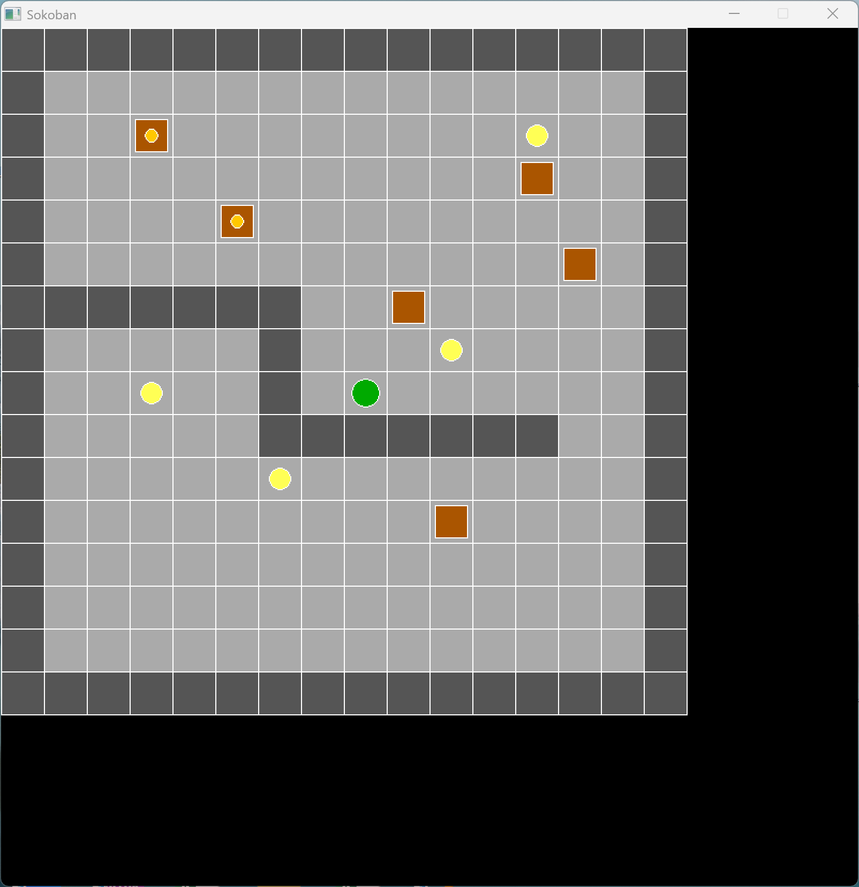

# 标题1
## 标题2
### 标题3
#### 标题4
##### 标题5
###### 标题6

> 这是一段引用

有序列表
把大象放进冰箱：
1. 打开冰箱
2. 把大象塞进去
3. 关上冰箱

无序列表
- 阿斯顿
- 啊实打实
- 啊手动阀

to do list:
- [ ] 吃饭
- [x] 睡觉
- [ ] 学习

代码块：
```c
int main()
{
    printf("Hello, world!\n");

    return 0;
}
```

```py
print('hello')
```

数学公式
$$
\frac{\partial f}{\partial x} = 2\sqrt{a}x
$$

表格：
|姓名|年龄|成绩|
|:---|---:|:---:|
|张三|19|99|
|李四|20|33|

脚注：
unvalid in editor VS Code

横线（注意空一行）

---
<hr/>

链接
[百度](baidu.com "一个搜索引擎")
引用链接
[百度][id],[百度][id],[百度][id]

[id]:google.com "一个搜索引擎"

请参考[标题1](#标题1)

URL:
http://www.baidu.com



*斜体* **加粗** `printf()` <u>下划线</u> ~~删除线~~ :) :( :| :smile: :cry:

$\theta=x^2$
H~2~O
x^2^
==这是一段高亮==

内置视频不支持，这里放上原作者视频链接
【8分钟让你快速掌握Markdown】 https://www.bilibili.com/video/BV1JA411h7Gw/?share_source=copy_web&vd_source=6b492f5cce375abcc7d01e43f51f0185